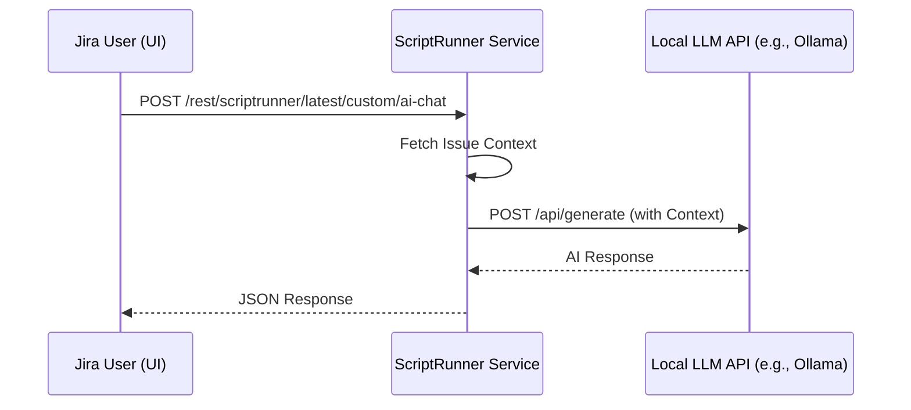
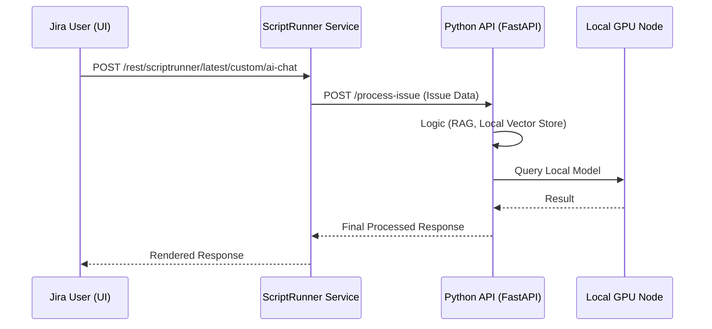
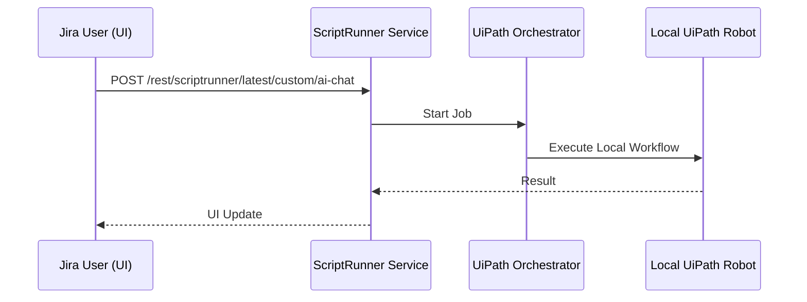

  
  <h2>"Pull up a stool, what can I help you with today?"</h2>
  
<i>Your friendly, local neighborhood AI Service Desk Assistant.</i>

---

# The Local Tender: Jira AI Assistant Integration

This project provides a modern, floating AI chat assistant for Jira Data Center, implemented via ScriptRunner.

  
  
<i>The UI integration seamlessly floating over your Jira issues.</i>

## Features

- **Contextual Intelligence**: Automatically includes Jira issue summary and description in prompts.
- **Modern UI**: Smooth animations, message bubbles, and typing indicators.
- **Secure**: All AI processing happens locally on your infrastructure.

## Integration Architecture

We have designed the backend to be flexible and secure by focusing on **Local LLM** deployments.

### 1. Direct Local LLM API (Current Implementation)

The default setup calls a local LLM service (e.g., Ollama, vLLM, or LocalAI) running within your firewalled environment.

### 2. Python Middleware Integration (Maximum Flexibility)

> [!TIP]
> **Recommended for Growth**: This approach allows you to run heavier Local LLMs on dedicated GPU servers while providing a clean API for ScriptRunner to consume.

### 3. UiPath Automation Integration

Ideal for triggering local automations using AI signals processed entirely on-premise.

---

## Technical Recommendation: High-Performance Local AI

For the best experience without exposing data, we recommend **Integration Path 2 (Python Middleware)** pointing to a dedicated local GPU instance running **vLLM** or **Ollama**.

- **Privacy**: Zero data leaves your network.
- **Performance**: High-speed inference using dedicated hardware.
- **Flexibility**: Easily swap Llama3, Mistral, or private fine-tuned models.

---

## Installation

Refer to the [walkthrough.md](file:///Users/jabrealj/.gemini/antigravity/brain/22d5c2b7-69a5-44bb-845f-4401a816d211/walkthrough.md) for detailed deployment steps.
